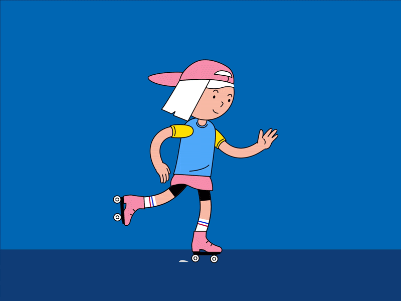

# 🌈 🌈 🌈

# DRAG CONTROLS

<br>
<br>
<hr>
<br>
<br>

# 🍨

# BUT BEFORE...

### Lets review the Floor Geometry and colors

- I DIDNT EXPLAIN ABOUT THE LOGIC OF THE CUBES AND THE GEOMETRIES OF THE FLOOR, It can be confusing when using the x,y,z.

<br>

#### To make the following code work, you need this 3 things:

```javascript
  sceneSetup = () => {
    //   You will need this to show the boxes
    // ----------------
    this.objects = [];
    //----------------
    this.vertex = new THREE.Vector3();
    this.color = new THREE.Color();
```

<br>

# 🍦 🐻 🍦

<br>

#### I will re use the same code of the geometries for the NEW test

- RIGHT Now the scene of the boxes is blocked!

- Its blocked because I removed the pointer Lock functions

<br>

```javascript
// ---------------
// floor Geometry
// ---------------
// How large do you want the floor, i added 2000 x 2000
this.floorGeometry = new THREE.PlaneGeometry(2000, 2000, 100, 100);
this.floorGeometry.rotateX(-Math.PI / 2);
//
//-------------------
// vertex displacement
//-------------------
//
let position = this.floorGeometry.attributes.position;
//
for (let i = 0, l = position.count; i < l; i++) {
  // Color and Position attributes of bufferGeometry
  //  check this exmaple to understand what is happening here:
  /*
      I am doing is making an array of colors (3 elements per 
        vertex representing rgb) and then trying to add it as an 
        attribute to the geometry, and I am trying to make vertices
         of different heights different colors
      
      */
  // https://stackoverflow.com/questions/50780187/three-js-color-and-position-attributes-of-buffergeometry-use-different-vertices
  this.vertex.fromBufferAttribute(position, i);
  this.vertex.x += Math.random() * 20 - 10;
  this.vertex.y += Math.random() * 2;
  this.vertex.z += Math.random() * 20 - 10;
  position.setXYZ(i, this.vertex.x, this.vertex.y, this.vertex.z);
}
// ensure each face has unique vertices  **
this.floorGeometry = this.floorGeometry.toNonIndexed();
//
position = this.floorGeometry.attributes.position;
//
//
//
//
//--------------
// colorsFloor
//--------------
const colorsFloor = [];
//
// what makes the triangles of the floor have different colors
for (let i = 0, l = position.count; i < l; i++) {
  //
  // here you are generating random colors HSL
  //   this.color is being picked from the variable on top "   this.color = new THREE.Color();"  linked to the Three modules
  this.color.setHSL(
    Math.random() * 0.3 + 0.5,
    0.75,
    Math.random() * 0.25 + 0.75
  );
  colorsFloor.push(this.color.r, this.color.g, this.color.b);
}
//
this.floorGeometry.setAttribute(
  "color",
  new THREE.Float32BufferAttribute(colorsFloor, 3)
);
//
//
this.floorMaterial = new THREE.MeshBasicMaterial({ vertexColors: true });
//
//
// ------------ Here you add to the scene all the ABOVE -----
this.floor = new THREE.Mesh(this.floorGeometry, this.floorMaterial);
this.scene.add(this.floor);
//
//
//
//
//
//
//
//
// ---------
// BOXES GEOMETRY
// ---------
// .toNonIndexed();  ensure each face has unique vertices
// SIZE of the boxes
this.boxGeometry = new THREE.BoxGeometry(20, 20, 20).toNonIndexed();
//
position = this.boxGeometry.attributes.position;
//
//
//--------------
// colors Box
//--------------
//
//
const colorsBox = [];
//
for (let i = 0, l = position.count; i < l; i++) {
  this.color.setHSL(
    // the different colors that will be picket randomly for the boxes, this "0.75" is the intensity of it ..will
    // make them look kind of pastel.
    Math.random() * 0.3 + 0.5,
    0.75,
    Math.random() * 0.25 + 0.75
  );
  colorsBox.push(this.color.r, this.color.g, this.color.b);
}
//
this.boxGeometry.setAttribute(
  "color",
  new THREE.Float32BufferAttribute(colorsBox, 3)
);
//
//
//
//
// the 500 correspond to the amount of boxes
// the material is MeshPhong, apparently its a good material to cast shadows
for (let i = 0; i < 500; i++) {
  //
  // the material of the box
  const boxMaterial = new THREE.MeshPhongMaterial({
    specular: 0xffffff,
    flatShading: true,
    vertexColors: true,
    // push a colour per vertex
  });
  //   color
  boxMaterial.color.setHSL(
    Math.random() * 0.2 + 0.5,
    0.75,
    Math.random() * 0.25 + 0.75
  );
  // ---------
  // BOX
  // ---------
  // Here you are positioning the 500 boxes randomly , playing with the x, y ,z
  const box = new THREE.Mesh(this.boxGeometry, boxMaterial);
  box.position.x = Math.floor(Math.random() * 20 - 10) * 20;
  box.position.y = Math.floor(Math.random() * 20) * 20 + 10;
  box.position.z = Math.floor(Math.random() * 20 - 10) * 20;

  this.scene.add(box);
  this.objects.push(box);
}
//
```

<br>
<br>
<hr>
<br>
<br>

# 🍦

# let's get started

[](https://www.youtube.com/watch?v=IKqV7DB8Iwg)

<br>

#### IMPORT the library from the "three" folder

```javascript
import { DragControls } from "three/examples/jsm/controls/DragControls";
```

<br>

#### Use it in your code

```javascript
sceneSetup = () => {
  //---------------------------
  //    DRAG CONTROLS
  //---------------------------
  this.controls = new DragControls(
    this.cubes,
    this.camera,
    renderer.domElement
  );
};
```
